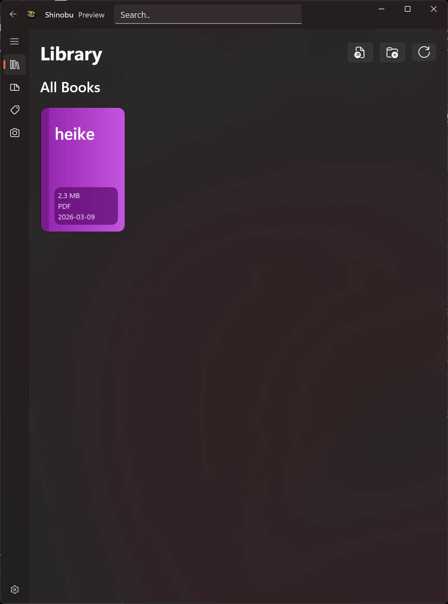
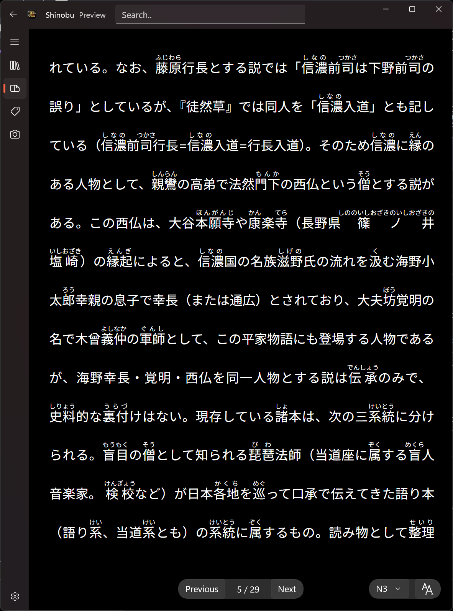
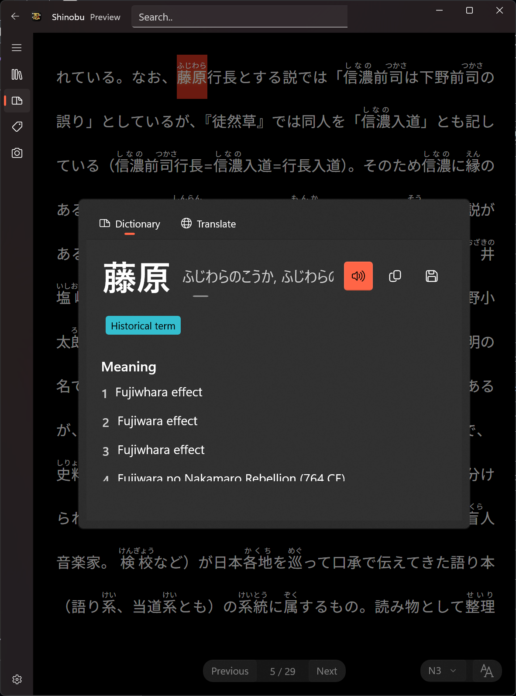

  

___

Shinobu is a Japanese reader app for learners, which automatically annotates plain Japanese text with furigana based on the selected Japanese level, and allows for quickly looking up words, translating sentences, and getting explanations.

Supports extensive customization of the reading experience, such as horizontal vs vertical text, line spacing, font, etc. and automatically paginates text for a book-like experience.

## Screenshots

<table>
  <tr>
    <td></td>
    <td></td>
  </tr>
  <tr>
    <td></td>
    <td></td>
  </tr>
</table>

## Dependencies

The application uses the following NuGet packages:

- Kawazu (1.0.0)
- LibNMeCab.IpaDicBin (0.10.0)
- LibNMeCab (0.10.1)
- Newtonsoft.Json (13.0.4)
- PdfPig (0.1.13)
- System.Drawing.Common (10.0.2)
- System.Speech (10.0.1)
- JishoNET (1.3.1)
- Tesseract (5.2.0)
- CommunityToolkit.WinUI.Controls.Primitives (8.2.251219)
- Microsoft.Web.WebView2 (1.0.3650.58)
- Microsoft.Windows.SDK.BuildTools (10.0.26100.7463)
- Microsoft.WindowsAppSDK (1.8.251106002)

Additionally, the following files need to be placed in the solution folder:
- jmdict-eng-3.6.1.json (Japanese dictionary data)
- jpn.traineddata (Tesseract OCR data for Japanese)
- jpn_vert.traineddata (Tesseract OCR data for vertical Japanese text)

## Todo
 - Finish up the selection dialog.
 - Finish Image OCR and annotation functionality.
 - Add epub reading functionality.
 - Auto download dictionary and Tesseract data files if not present.
 - Performance and stability improvements.
 - Release on the Microsoft Store.

## Attribution
- The text in the screenshots is from the Wikipedia article https://ja.wikipedia.org/wiki/%E5%B9%B3%E5%AE%B6%E7%89%A9%E8%AA%9E, Licensed under CC BY-SA 4.0
https://creativecommons.org/licenses/by-sa/4.0/
- Online dictionary lookup powered by Jisho.org
Dictionary data from JMdict/EDICT and KANJIDIC
© The Electronic Dictionary Research and Development Group.

Work in progress
